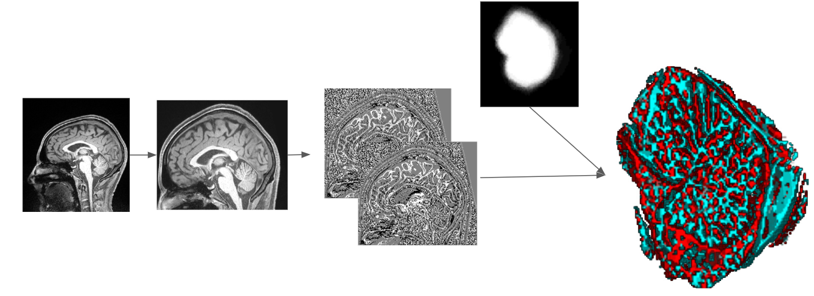
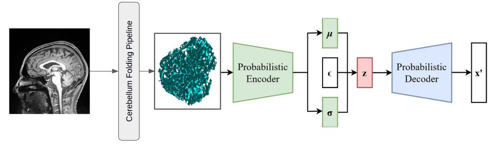

# Cerebellum - deep learning analysis tool

This repository contains analysis for anomaly detection in the cerebellum based on $\beta$-Variationnal AutoEncoders. It follows [Guillon & al., 2024](://direct.mit.edu/imag/article/doi/10.1162/imag_a_00084/119130/Identification-of-rare-cortical-folding-patterns) work : **Identification of rare folding patterns using unsupervised deep learning**. 

# Dependencies

- `python == 3.11`
- `torch >=2.4.1`
- `numpy >=1.26.4`
- `pandas >=`

# Structure of the repository

## `cerebellum_folding` : Preprocessing pipeline to extract cerebellum geometric features

This pipeline require `soma` package (`aims`) for nifti manipulation.

The process is the following one :

## `betaVAE` : Architecture used for anomaly detection

It contains deep learning models used for this study. 

